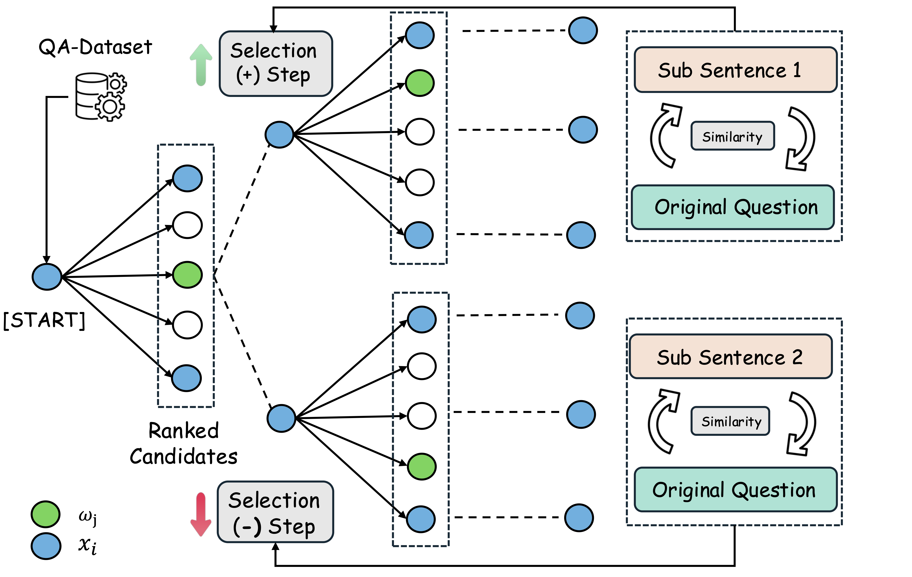

# Dynamic Optimization Beam Search (DOBS)

**Abstract:**  With the increasing number of applications relying on Large Language Models (LLMs), many LLM manufacturers have incorporated automatic prompt engineering into their GUIs to improve the precision of user input and achieve more accurate responses. However, due to the diversity of user requirements faced by LLMS, using automatic prompt optimization strategies by default in various scenarios may misinterpret user intentions and lead to unintentional prompt negative optimization, resulting in erroneous LLM outputs. In this paper, the dynamic optimization beam search method is proposed to restore this scenario, which simulates most automatic prompt engineering as a method that can ensure the dynamic stability of the semantics of attack samples to explore the impact of the widespread application of this kind of strategy on LLM. This study achieves good attack results on various multi-category open-source and closed-source models, which provides valuable insights for the design and robustness of automatic prompt projects.



**Initial Settings**

Please install ollama first. Linux server samples: 

```bash
curl -fsSL https://ollama.com/install.sh | sh
ollama serve
ollama pull [target models] 
```

Here, our target models in experiments can be found in: 
[llama3.1, llama3.2, llama3.3, qwen2.5, gemma2, phi3.5]

The closed-source model [gpt-4o-latest, gpt-4-turbbo] is available via the OpenAI API.

**Main Test**

The datasets you need to download and place in a specific location：```bash /Dataset/```, all in JSON format.
```bash
GSM-IC_mstep.json,
SVAMP.json (Need Reshape),
SQUAD.json,
StrategyQA.json,
MovieQA.json,
ComplexWebQuestions.json
```
The test process can be run directly from our bash script：

```bash
sh /Bash_scripts/Auto_bash.sh
sh /Bash_scripts/Auto_eval_ablation.sh
sh /Bash_scripts/Auto_eval_gpt.sh
```
Or you can run it with custom arguments:

```python
python Main.py --api_key [openai key] --baidu_key [Baidu Qianfan Key] --gemini_key [Google Gemini Key]
               --question_limits [Number of tested problems] --beam_width [the max beam width] --tokenizer [tokenizer] --embedding_model [The detailed BERT type.]
               --target_model [llama3.1:8b, llama3.1:70b, qwen2.5:1.5b, qwen2.5:3b, qwen2.5:7b, qwen2.5:14b, gemma2:2b, gemma2:9b, phi3.5:3.8b, ...]
               --filename [the dataset selected file name: gsm, webqa, movqa, compx, ....]
```


